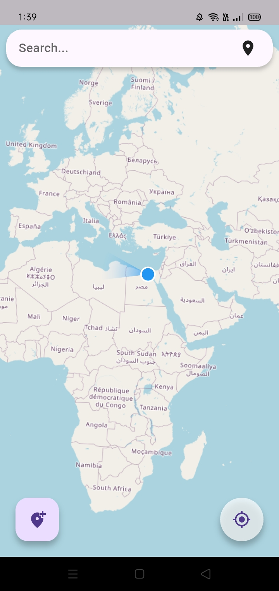
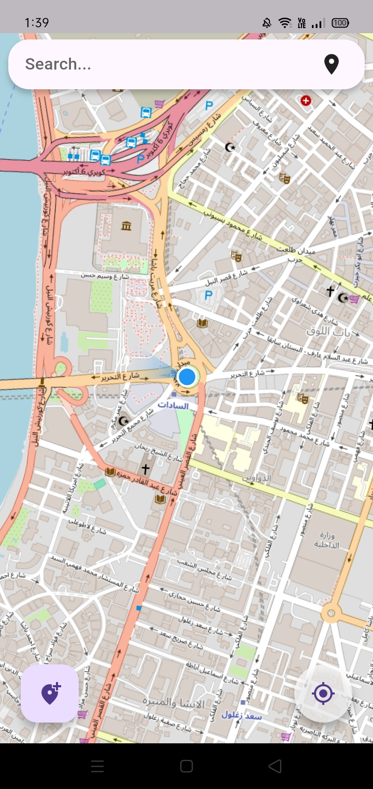
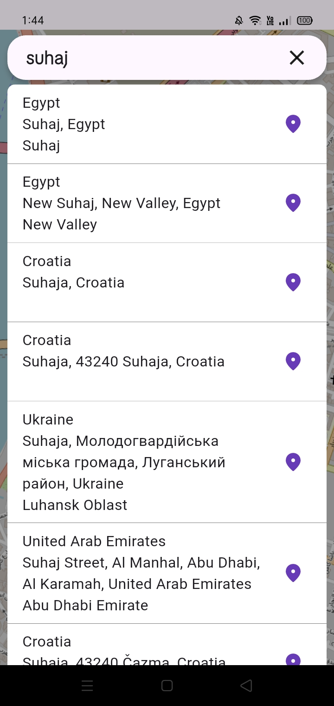

# MyMap 🚀

**A lightweight Flutter map viewer with location tracking, place search, and marker management.**

---

[](https://flutter.dev/) [](LICENSE)

## Table of Contents

- [MyMap 🚀](#mymap-)
  - [Table of Contents](#table-of-contents)
  - [Features ✅](#features-)
  - [Demo](#demo)
  - [Quick Start — Installation 🔧](#quick-start--installation-)
    - [Prerequisites](#prerequisites)
    - [Clone \& install](#clone--install)
    - [API Keys](#api-keys)
    - [Run](#run)
    - [Build](#build)
  - [Usage Examples — Code Snippets 💡](#usage-examples--code-snippets-)
    - [App entry (`lib/main.dart`)](#app-entry-libmaindart)
    - [Map viewer (`lib/core/widgets/flutter_map.dart`)](#map-viewer-libcorewidgetsflutter_mapdart)
    - [Search helper (`lib/core/widgets/searchbar.dart`)](#search-helper-libcorewidgetssearchbardart)
  - [Folder Structure Overview 🗂️](#folder-structure-overview-️)
  - [Tech Stack \& Key Dependencies 🧰](#tech-stack--key-dependencies-)
  - [Security \& Notes ⚠️](#security--notes-️)

---

## Features ✅

- Live device location tracking with permission handling (`geolocator`)  
- Interactive map tiles using OpenStreetMap (`flutter_map`)  
- Place autocomplete & suggestions (Geoapify) with a floating search bar  
- Add/confirm/cancel markers by tapping the map  
- Responsive UI support (`flutter_screenutil`), Lottie animations, and custom fonts  
- User-friendly permission dialogs (`quickalert`)

---

## Demo

<p align="center">
  &nbsp;&nbsp;&nbsp;
  &nbsp;&nbsp;&nbsp;
  
</p>

Open the app and grant location permission at launch. The home screen shows a Lottie animation while locating the device; once found, it navigates to the map viewer with live location and search.

---

## Quick Start — Installation 🔧

### Prerequisites

- Flutter SDK (Dart >= 3.8.1). Follow: <https://flutter.dev/docs/get-started/install>
- Android Studio / Xcode / or a connected device/emulator

### Clone & install

```bash
git clone https://github.com/shehabs-dev/MyMapp.git
cd MyMapp
flutter pub get
```

### API Keys

- The project uses Geoapify for place autocomplete. Do **not** commit API keys into source.
- Recommended: use environment variables (e.g. `.env` with `flutter_dotenv`) or CI secrets.

Example using `flutter_dotenv`:

```dart
// main.dart
import 'package:flutter_dotenv/flutter_dotenv.dart';

Future<void> main() async {
  await dotenv.load(fileName: ".env");
  runApp(NavigatorPage());
}

// in `searchPlaces`:
final apiKey = dotenv.env['GEOAPIFY_API_KEY'] ?? 'YOUR_KEY';
```

Add `.env` to `.gitignore`.

### Run

```bash
flutter run -d <device-id>
```

### Build

```bash
flutter build apk --release
# or for iOS
flutter build ios --release
```

---

## Usage Examples — Code Snippets 💡

### App entry (`lib/main.dart`)

```dart
void main() => runApp(NavigatorPage());

class NavigatorPage extends StatelessWidget {
  @override
  Widget build(BuildContext context) {
    return ScreenUtilInit(
      designSize: Size(360, 690),
      builder: (context, child) => MaterialApp(
        theme: getLightTheme(),
        initialRoute: '/',
        routes: {'/': (context) => HomePage(), 'Map': (context) => MapViewer()},
      ),
    );
  }
}
```

### Map viewer (`lib/core/widgets/flutter_map.dart`)

```dart
FlutterMap(
  options: MapOptions(
    initialCenter: LatLng(30.0444, 31.2357),
    initialZoom: 15,
    onTap: (tapPosition, point) {/* add marker */},
  ),
  children: [
    TileLayer(urlTemplate: 'https://tile.openstreetmap.org/{z}/{x}/{y}.png'),
    CurrentLocationLayer(positionStream: positionStream),
    MarkerLayer(markers: markers),
  ],
)
```

### Search helper (`lib/core/widgets/searchbar.dart`)

```dart
Future<List<Map<String,dynamic>>> searchPlaces(String query) async {
  final response = await get(Uri.parse(
      'https://api.geoapify.com/v1/geocode/autocomplete?text=$query&lang=en&limit=10&apiKey=YOUR_API_KEY'));
  final responseBody = jsonDecode(response.body);
  final features = responseBody['features'] as List;
  return features.map((e) => e['properties'] as Map<String,dynamic>).toList();
}
```

---

## Folder Structure Overview 🗂️

```
lib/
├─ main.dart                # App entry and routing
├─ home_page.dart           # Permission checks & entry point for MapViewer
├─ core/
│  ├─ widgets/
│  │  ├─ flutter_map.dart   # Map viewer & UI controls
│  │  └─ searchbar.dart     # Floating search bar & Geoapify integration
│  ├─ services/
│  │  └─ location_handling.dart # Permission & location helpers
│  └─ theme/                # Theme data
assets/
├─ animation/               # Lottie animations
fonts/
android/ ios/ linux/ macos/ web/ windows/
test/
```

---

## Tech Stack & Key Dependencies 🧰

- Flutter (Dart)  
- flutter_map — OpenStreetMap widgets  
- flutter_map_location_marker — device marker and stream integration  
- geolocator — device location & permissions  
- latlong2 — LatLng utilities  
- material_floating_search_bar_2 — floating search UI  
- http — REST requests (Geoapify)  
- quickalert — quick dialogs for permissions  
- flutter_screenutil, lottie, google_fonts, font_awesome_flutter

See full list in `pubspec.yaml`.

---

## Security & Notes ⚠️

> A Geoapify key was detected in the codebase. Please remove any hard-coded API keys and use environment variables or secure storage for production secrets.

Recommended improvements:

- Move API keys to environment variables or CI secrets
- Add unit & widget tests for `searchPlaces` and `GeoL.determinePosition` with mocks
- Add CI (GitHub Actions) to run `flutter analyze`, `flutter test`, and formatting checks

---
